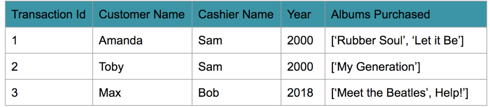

# Lesson 2 Exercise 1: Creating Normalized Tables


## In this exercise we are going to walk through the basics of modeling data in normalized form. We will create tables in PostgreSQL, insert rows of data, and do simple JOIN SQL queries to show how these mutliple tables can work together. 

#### Where you see ##### you will need to fill in code.

Note: __Do not__ click the blue Preview button in the lower task bar

#### Import the library 
Note: An error might popup after this command has exectuted. If it does, read it carefully before ignoring. 


```python
import psycopg2
```

__Create a connection to the database, get a cursor, and set autocommit to true)__


```python
try: 
    conn = psycopg2.connect("host=127.0.0.1 dbname=studentdb user=student password=student")
except psycopg2.Error as e: 
    print("Error: Could not make connection to the Postgres database")
    print(e)
try: 
    cur = conn.cursor()
except psycopg2.Error as e: 
    print("Error: Could not get cursor to the Database")
    print(e)
conn.set_session(autocommit=True)
```

#### Let's imagine we have a table called Music Store. 

`Table Name: music_store
column 0: Transaction Id
column 1: Customer Name
column 2: Cashier Name
column 3: Year 
column 4: Albums Purchased`


## Now to translate this information into a CREATE Table Statement and insert the data




```python
# TO-DO: Add the CREATE Table Statement and INSERT statements to add the data in the table

try: 
    cur.execute("CREATE TABLE IF NOT EXISTS music_store (#####)")
except psycopg2.Error as e: 
    print("Error: Issue creating table")
    print (e)
    
try: 
    cur.execute("INSERT INTO music_store (#####) \
                 VALUES (%s, %s, %s, %s, %s)", \
                 (#####))
except psycopg2.Error as e: 
    print("Error: Inserting Rows")
    print (e)
    
try: 
    cur.execute("INSERT INTO music_store (#####) \
                 VALUES (%s, %s, %s, %s, %s)", \
                 (#####))
except psycopg2.Error as e: 
    print("Error: Inserting Rows")
    print (e)
    
try: 
    cur.execute("INSERT INTO music_store (#####) \
                 VALUES (%s, %s, %s, %s, %s)", \
                 (#####))
except psycopg2.Error as e: 
    print("Error: Inserting Rows")
    print (e)
    
    
try: 
    cur.execute("SELECT * FROM music_store;")
except psycopg2.Error as e: 
    print("Error: select *")
    print (e)

row = cur.fetchone()
while row:
   print(row)
   row = cur.fetchone()
```

#### Moving to 1st Normal Form (1NF)

### TO-DO: This data has not been normalized. To get this data into 1st normal form, you need to remove any collections or list of data and break up the list of songs into individual rows. 


```python
## TO-DO: Complete the CREATE table statements and INSERT statements

try: 
    cur.execute("CREATE TABLE IF NOT EXISTS music_store2 (#####);")
except psycopg2.Error as e: 
    print("Error: Issue creating table")
    print (e)
    
try: 
    cur.execute("INSERT INTO music_store2 (#####) \
                 VALUES (%s, %s, %s, %s, %s)", \
                 (#####))
except psycopg2.Error as e: 
    print("Error: Inserting Rows")
    print (e)

try: 
    cur.execute("INSERT INTO music_store2 (#####) \
                 VALUES (%s, %s, %s, %s, %s)", \
                 (#####))
except psycopg2.Error as e: 
    print("Error: Inserting Rows")
    print (e)
    
try: 
    cur.execute("INSERT INTO music_store2 (#####) \
                 VALUES (%s, %s, %s, %s, %s)", \
                 (#####))
except psycopg2.Error as e: 
    print("Error: Inserting Rows")
    print (e)
    
try: 
    cur.execute("INSERT INTO music_store2 (#####) \
                 VALUES (%s, %s, %s, %s, %s)", \
                 (#####))
except psycopg2.Error as e: 
    print("Error: Inserting Rows")
    print (e)
    
try: 
    cur.execute("INSERT INTO music_store2 (#####) \
                 VALUES (%s, %s, %s, %s, %s)", \
                 (#####))
except psycopg2.Error as e: 
    print("Error: Inserting Rows")
    print (e)
    
try: 
    cur.execute("SELECT * FROM music_store2;")
except psycopg2.Error as e: 
    print("Error: select *")
    print (e)

row = cur.fetchone()
while row:
   print(row)
   row = cur.fetchone()
```

#### Moving to 2nd Normal Form (2NF)
You have now moved the data into 1NF, which is the first step in moving to 2nd Normal Form. The table is not yet in 2nd Normal Form. While each of the records in the table is unique, our Primary key (transaction id) is not unique. 

### TO-DO: Break up the table into two tables, transactions and albums sold. 


```python
try: 
    cur.execute("CREATE TABLE IF NOT EXISTS transactions (#####);")
except psycopg2.Error as e: 
    print("Error: Issue creating table")
    print (e)

try: 
    cur.execute("CREATE TABLE IF NOT EXISTS albums_sold (#####);")
except psycopg2.Error as e: 
    print("Error: Issue creating table")
    print (e)
    
try: 
    cur.execute("INSERT INTO transactions (#####) \
                 VALUES (%s, %s, %s, %s)", \
                 (#####))
except psycopg2.Error as e: 
    print("Error: Inserting Rows")
    print (e)

try: 
    cur.execute("INSERT INTO transactions (#####) \
                 VALUES (%s, %s, %s, %s)", \
                 (#####))
except psycopg2.Error as e: 
    print("Error: Inserting Rows")
    print (e)
    
try: 
    cur.execute("INSERT INTO transactions (#####) \
                 VALUES (%s, %s, %s, %s)", \
                 (#####))
except psycopg2.Error as e: 
    print("Error: Inserting Rows")
    print (e)
    
try: 
    cur.execute("INSERT INTO albums_sold (#####) \
                 VALUES (%s, %s, %s)", \
                 (#####))
except psycopg2.Error as e: 
    print("Error: Inserting Rows")
    print (e)

try: 
    cur.execute("INSERT INTO albums_sold (#####) \
                 VALUES (%s, %s, %s)", \
                 (#####))
except psycopg2.Error as e: 
    print("Error: Inserting Rows")
    print (e)
    
try: 
    cur.execute("INSERT INTO albums_sold (#####) \
                 VALUES (%s, %s, %s)", \
                 (######))
except psycopg2.Error as e: 
    print("Error: Inserting Rows")
    print (e)
    
try: 
    cur.execute("INSERT INTO albums_sold (#####) \
                 VALUES (%s, %s, %s)", \
                 (#####))
except psycopg2.Error as e: 
    print("Error: Inserting Rows")
    print (e)

try: 
    cur.execute("INSERT INTO albums_sold (#####) \
                 VALUES (%s, %s, %s)", \
                 (#####))
except psycopg2.Error as e: 
    print("Error: Inserting Rows")
    print (e)

print("Table: transactions\n")
try: 
    cur.execute("SELECT * FROM transactions;")
except psycopg2.Error as e: 
    print("Error: select *")
    print (e)

row = cur.fetchone()
while row:
   print(row)
   row = cur.fetchone()

print("\nTable: albums_sold\n")
try: 
    cur.execute("SELECT * FROM albums_sold;")
except psycopg2.Error as e: 
    print("Error: select *")
    print (e)
row = cur.fetchone()
while row:
   print(row)
   row = cur.fetchone()
```

### TO-DO: Do a `JOIN` on these tables to get all the information in the original first Table. 


```python
## TO-DO: Complete the join on the transactions and album_sold tables

try: 
    cur.execute("SELECT * FROM ##### JOIN ##### ON ##### = ##### ;")
except psycopg2.Error as e: 
    print("Error: select *")
    print (e)

row = cur.fetchone()
while row:
   print(row)
   row = cur.fetchone()

```

#### Moving to 3rd Normal Form (3NF)
Check our table for any transitive dependencies. 
_HINT:_ Check the table for any transitive dependencies. _Transactions_ can remove _Cashier Name_ to its own table, called _Employees_, which will leave us with 3 tables. 


### TO-DO: Create the third table named *employees* to move to 3rd NF. 


```python
try: 
    cur.execute("CREATE TABLE IF NOT EXISTS transactions2 (#####);")
except psycopg2.Error as e: 
    print("Error: Issue creating table")
    print (e)

try: 
    cur.execute("CREATE TABLE IF NOT EXISTS employees (#####);")
except psycopg2.Error as e: 
    print("Error: Issue creating table")
    print (e)

try: 
    cur.execute("INSERT INTO transactions2 (#####) \
                 VALUES (%s, %s, %s, %s)", \
                 (#####))
except psycopg2.Error as e: 
    print("Error: Inserting Rows")
    print (e)

try: 
    cur.execute("INSERT INTO transactions2 (#####) \
                 VALUES (%s, %s, %s, %s)", \
                 (#####))
except psycopg2.Error as e: 
    print("Error: Inserting Rows")
    print (e)
    
try: 
    cur.execute("INSERT INTO transactions2 (#####) \
                 VALUES (%s, %s, %s, %s)", \
                 (#####))
except psycopg2.Error as e: 
    print("Error: Inserting Rows")
    print (e)

try: 
    cur.execute("INSERT INTO employees (#####) \
                 VALUES (%s, %s)", \
                 (#####))
except psycopg2.Error as e: 
    print("Error: Inserting Rows")
    print (e)

try: 
    cur.execute("INSERT INTO employees (#####) \
                 VALUES (%s, %s)", \
                 (#####))
except psycopg2.Error as e: 
    print("Error: Inserting Rows")
    print (e)    

print("Table: transactions2\n")
try: 
    cur.execute("SELECT * FROM transactions2;")
except psycopg2.Error as e: 
    print("Error: select *")
    print (e)

row = cur.fetchone()
while row:
   print(row)
   row = cur.fetchone()

print("\nTable: albums_sold\n")
try: 
    cur.execute("SELECT * FROM albums_sold;")
except psycopg2.Error as e: 
    print("Error: select *")
    print (e)

row = cur.fetchone()
while row:
   print(row)
   row = cur.fetchone()

print("\nTable: employees\n")
try: 
    cur.execute("SELECT * FROM employees;")
except psycopg2.Error as e: 
    print("Error: select *")
    print (e)

row = cur.fetchone()
while row:
   print(row)
   row = cur.fetchone()
```

### TO-DO: Complete the last two `JOIN` on these 3 tables so we can get all the information we had in our first Table. 


```python
try: 
    cur.execute("SELECT * FROM (##### JOIN ##### ON \
                               ##### = #####) JOIN \
                               ##### ON #####=#####;")
except psycopg2.Error as e: 
    print("Error: select *")
    print (e)

row = cur.fetchone()
while row:
   print(row)
   row = cur.fetchone()
```

### Your output for the above cell should be:

(1, 'Amanda', 1, 2000, 1, 1, 'Rubber Soul', 1, 'Sam')<br>
(1, 'Amanda', 1, 2000, 2, 1, 'Let it Be', 1, 'Sam')<br>
(2, 'Toby', 1, 2000, 3, 2, 'My Generation', 1, 'Sam')<br>
(3, 'Max', 2, 2018, 4, 3, 'Meet the Beatles', 2, 'Bob')<br>
(3, 'Max', 2, 2018, 5, 3, 'Help!', 2, 'Bob')<br>


### Awesome work!! You have Normalized the dataset! 

### And finally close your cursor and connection. 


```python
try: 
    cur.execute("DROP table music_store")
except psycopg2.Error as e: 
    print("Error: Dropping table")
    print (e)
try: 
    cur.execute("DROP table music_store2")
except psycopg2.Error as e: 
    print("Error: Dropping table")
    print (e)
try: 
    cur.execute("DROP table albums_sold")
except psycopg2.Error as e: 
    print("Error: Dropping table")
    print (e)
try: 
    cur.execute("DROP table employees")
except psycopg2.Error as e: 
    print("Error: Dropping table")
    print (e)
try: 
    cur.execute("DROP table transactions")
except psycopg2.Error as e: 
    print("Error: Dropping table")
    print (e)
try: 
    cur.execute("DROP table transactions2")
except psycopg2.Error as e: 
    print("Error: Dropping table")
    print (e)
```

### And finally close your cursor and connection. 


```python
cur.close()
conn.close()
```
