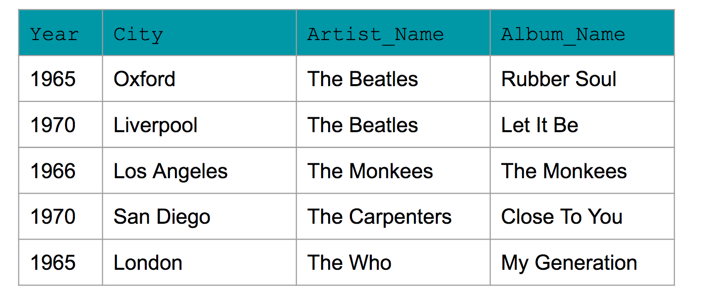

# Lesson 3 Demo 4: Using the WHERE Clause


### In this demo we are going to walk through the basics of using the WHERE clause in Apache Cassandra.

#### We will use a python wrapper/ python driver called cassandra to run the Apache Cassandra queries. This library should be preinstalled but in the future to install this library you can run this command in a notebook to install locally: 
! pip install cassandra-driver
#### More documentation can be found here:  https://datastax.github.io/python-driver/

#### Import Apache Cassandra python package


```python
import cassandra
```

### First let's create a connection to the database


```python
from cassandra.cluster import Cluster
try: 
    cluster = Cluster(['127.0.0.1']) #If you have a locally installed Apache Cassandra instance
    session = cluster.connect()
except Exception as e:
    print(e)
```

### Let's create a keyspace to do our work in 


```python
try:
    session.execute("""
    CREATE KEYSPACE IF NOT EXISTS udacity 
    WITH REPLICATION = 
    { 'class' : 'SimpleStrategy', 'replication_factor' : 1 }"""
)

except Exception as e:
    print(e)
```

#### Connect to our Keyspace. Compare this to how we had to create a new session in PostgreSQL.  


```python
try:
    session.set_keyspace('udacity')
except Exception as e:
    print(e)
```

### Let's imagine we would like to start creating a new Music Library of albums. 
### We want to ask 4 question of our data
#### 1. Give me every album in my music library that was released in a given year
`select * from music_library WHERE YEAR=1970`
#### 2. Give me the album that is in my music library that was released in a given year by "The Beatles"
`select * from music_library WHERE YEAR = 1970 AND ARTIST_NAME = "The Beatles"`
#### 3. Give me all the albums released in a given year in a give location 
`select * from music_library WHERE YEAR = 1970 AND LOCATION = "Liverpool"`
#### 4. Give me city that the albumn "Let It Be" was recorded
`select city from music_library WHERE YEAR = "1970" AND ARTIST_NAME = "The Beatles" AND ALBUM_NAME="Let it Be"`


### Here is our Collection of Data


### How should we model this data? What should be our Primary Key and Partition Key? Since our data is looking for the YEAR let's start with that. From there we will add clustering columns on Artist Name and Album Name.

`Table Name: music_library
column 1: Year
column 2: Artist Name
column 3: Album Name
Column 4: City
PRIMARY KEY(year, artist_name, album_name)`


```python
query = "CREATE TABLE IF NOT EXISTS music_library "
query = query + "(year int, artist_name text, album_name text, city text, PRIMARY KEY (year, artist_name, album_name))"
try:
    session.execute(query)
except Exception as e:
    print(e)
```

### Let's insert our data into of table


```python
query = "INSERT INTO music_library (year, artist_name, album_name, city)"
query = query + " VALUES (%s, %s, %s, %s)"

try:
    session.execute(query, (1970, "The Beatles", "Let it Be", "Liverpool"))
except Exception as e:
    print(e)
    
try:
    session.execute(query, (1965, "The Beatles", "Rubber Soul", "Oxford"))
except Exception as e:
    print(e)
    
try:
    session.execute(query, (1965, "The Who", "My Generation", "London"))
except Exception as e:
    print(e)

try:
    session.execute(query, (1966, "The Monkees", "The Monkees", "Los Angeles"))
except Exception as e:
    print(e)

try:
    session.execute(query, (1970, "The Carpenters", "Close To You", "San Diego"))
except Exception as e:
    print(e)
```

### Let's Validate our Data Model with our 4 queries.

`select * from music_library WHERE YEAR=1970`


```python
query = "select * from music_library WHERE YEAR=1970"
try:
    rows = session.execute(query)
except Exception as e:
    print(e)
    
for row in rows:
    print (row.year, row.artist_name, row.album_name, row.city)
```

    1970 The Beatles Let it Be Liverpool
    1970 The Carpenters Close To You San Diego


### Success it worked! Let's try the 2nd query.

`select * from music_library WHERE YEAR = 1970 AND ARTIST_NAME = "The Beatles"`


```python
query = "select * from music_library WHERE YEAR=1970 AND ARTIST_NAME = 'The Beatles'"
try:
    rows = session.execute(query)
except Exception as e:
    print(e)
    
for row in rows:
    print (row.year, row.artist_name, row.album_name, row.city)
```

    1970 The Beatles Let it Be Liverpool


### Success it worked! Let's try the 3rd query.
`select * from music_library WHERE YEAR = 1970 AND LOCATION = "Liverpool"`


```python
query = "select * from music_library WHERE YEAR = 1970 AND LOCATION = 'Liverpool'"
try:
    rows = session.execute(query)
except Exception as e:
    print(e)
    
for row in rows:
    print (row.year, row.artist_name, row.album_name, row.city)
```

    Error from server: code=2200 [Invalid query] message="Undefined column name location"


### Error! You can not try to access a column or a clustering column if you have not used the other defined clustering column. Let's see if we can try it a different way. 
`select city from music_library WHERE YEAR = "1970" AND ARTIST_NAME = "The Beatles" AND ALBUM_NAME="Let it Be"`


```python
query = "select city from music_library WHERE YEAR = 1970 AND ARTIST_NAME = 'The Beatles' AND ALBUM_NAME='Let it Be'"
try:
    rows = session.execute(query)
except Exception as e:
    print(e)
    
for row in rows:
    print (row.city)
```

    Liverpool


### For the sake of the demo, I will drop the table. 


```python
query = "drop table music_library"
try:
    rows = session.execute(query)
except Exception as e:
    print(e)
```

### And Finally close the session and cluster connection


```python
session.shutdown()
cluster.shutdown()
```


```python

```
