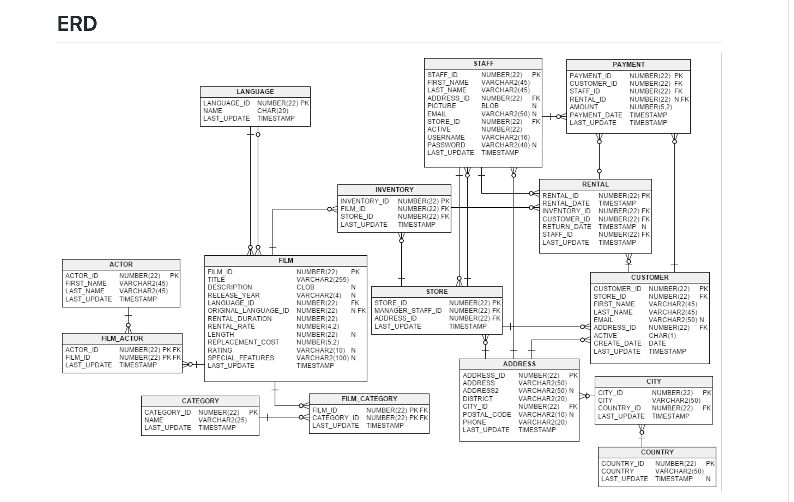
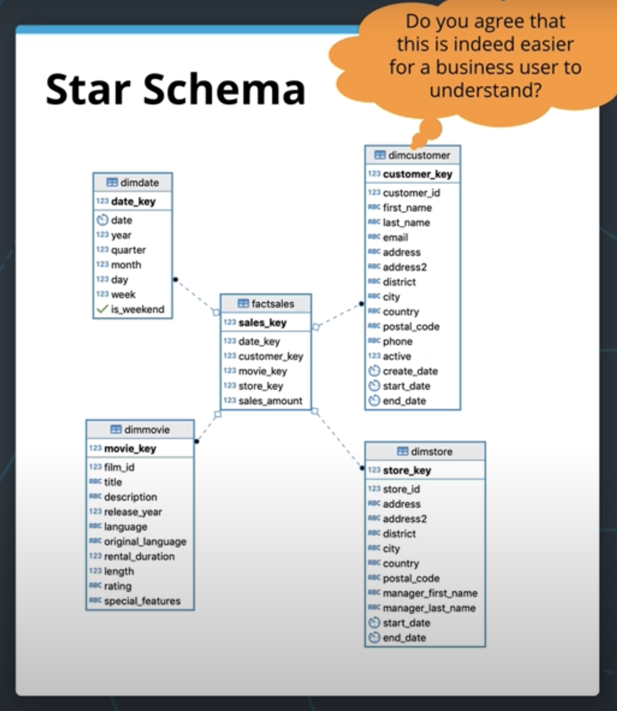

### Sakils DVD Data Modeling

```Below Diagram is 3NF Schema:```



####The Facts tables are in the above ERD :
* ```Rental```
* ```Payments```


####The Dimension tables are in the above ERD :
* ```Customer```
* ```Store```
* ```Staff```
* ```film```  

```NOTE```: The ERD is difficult for the bussiness user to understand the relationp between the tables and is quite cumbersome.


### Below Star Schema to Represent the Fact table in much confined way to make the bussiness analyst easier to understand:


