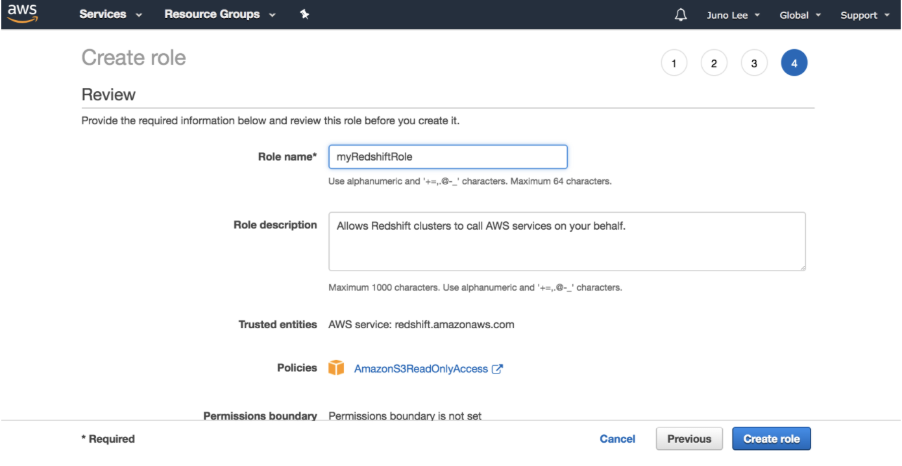

###Create an IAM Role
Here, you'll create an IAM role that you will later attach to your Redshift cluster to enable your cluster to load data from Amazon S3 buckets. Read more about IAM roles and Redshift [here](https://docs.aws.amazon.com/redshift/latest/gsg/rs-gsg-create-an-iam-role.html).

1. Sign in to the AWS Management Console and open the IAM console at https://console.aws.amazon.com/iam/.
2. In the left navigation pane, choose ```Roles```.
3. Choose ```Create role```.

    

4. In the ```AWS Service``` group, choose ```Redshift```.
5. Under ```Select your use case```, choose ```Redshift - Customizable```, and then ```Next: Permissions```.
    
6. On the Attach permissions policies page, choose ```AmazonS3ReadOnlyAccess```, and then choose ```Next: Tags```.
7. Skip this page and choose ```Next: Review```.
    
8. For ```Role name```, enter ```myRedshiftRole```, and then choose ```Create Role```.
    
   
You can now attach this role when you launch a new cluster or attach it to an existing cluster. In the next page, you'll attach the role to a new cluster.

