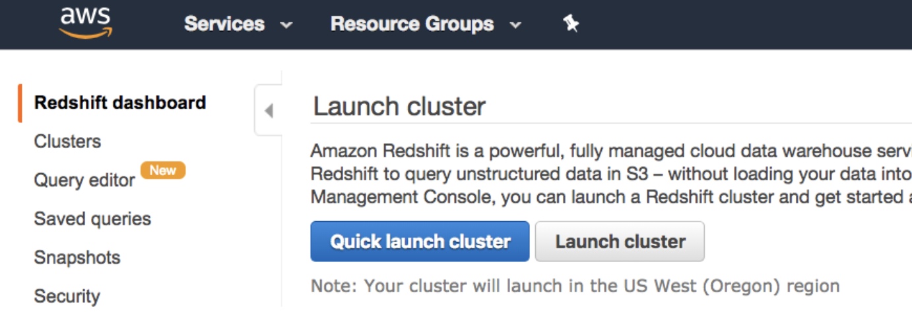
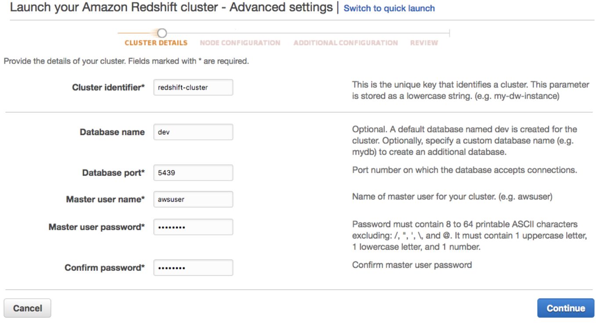
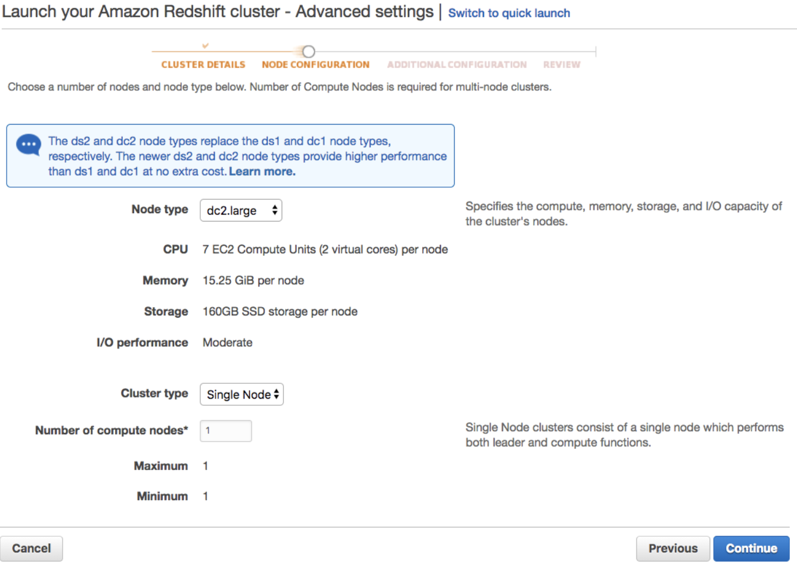
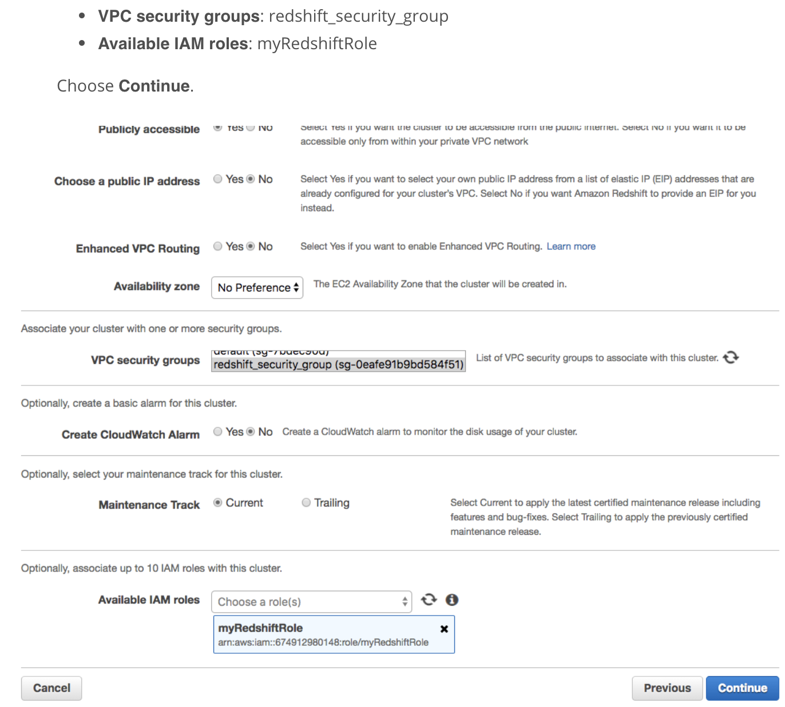
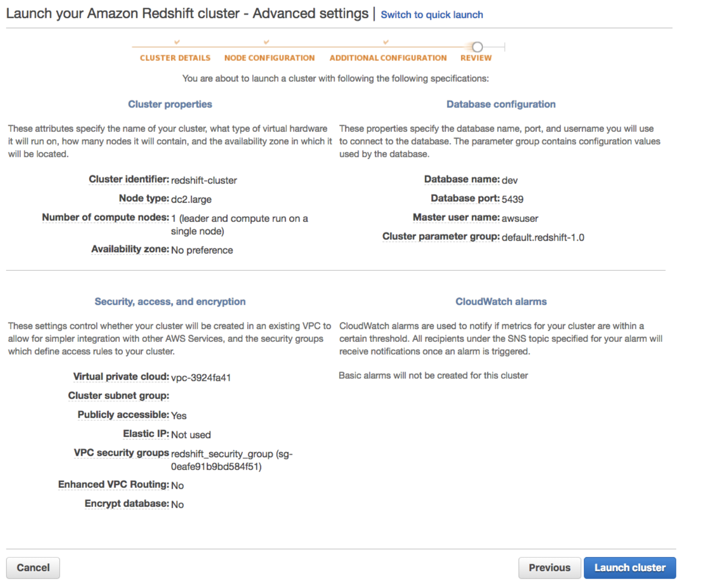
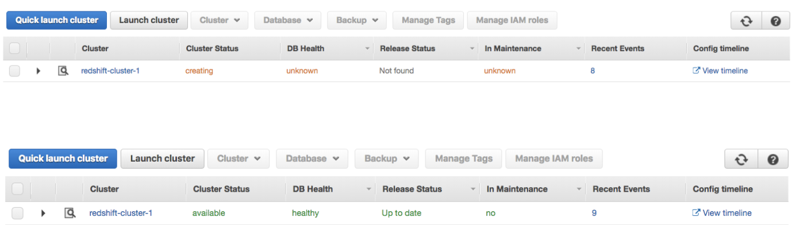

###Launch a Redshift Cluster
```WARNING```: The cluster that you are about to launch will be live, and you will be charged the standard Amazon Redshift usage fees for the cluster until you delete it. ```Make sure to delete your cluster each time you're finished working to avoid large, unexpected costs for yourself.``` Instructions on deleting your cluster are included on the last page in this lesson. You can always launch a new cluster, so don't leave your Redshift cluster running overnight or throughout the week if you don't need to.

1. Sign in to the AWS Management Console and open the Amazon Redshift console at https://console.aws.amazon.com/redshift/.
2. On the Amazon Redshift Dashboard, choose Launch cluster.
    
3. On the Cluster details page, enter the following values and then choose Continue:
    * ```Cluster identifier```: Enter redshift-cluster.
    * ```Database name```: Enter dev.
    * ```Database port```: Enter 5439.
    * ```Master user name```: Enter awsuser.
    * ```Master user password and Confirm password```: Enter a password for the master user account.
    
    ```NOTE:``` Please note: We strongly advise you to keep these passwords closely guarded, including not putting them in your GitHub public repo, etc.
    
4. On the Node Configuration page, accept the default values and choose ```Continue```.
    
5. On the Additional Configuration page, enter the following values:
    
6. Review your Cluster configuration and choose Launch cluster.
    
7. A confirmation page will appear and the cluster will take a few minutes to finish. Choose ```Clusters``` in the left navigation pane to return to the list of clusters.
8. On the Clusters page, look at the cluster that you just launched and review the ```Cluster Status``` information. Make sure that the ```Cluster Status``` is available and the ```Database Health``` is ```healthy``` before you try to connect to the database later. You can expect this to take 5-10 minutes
    


