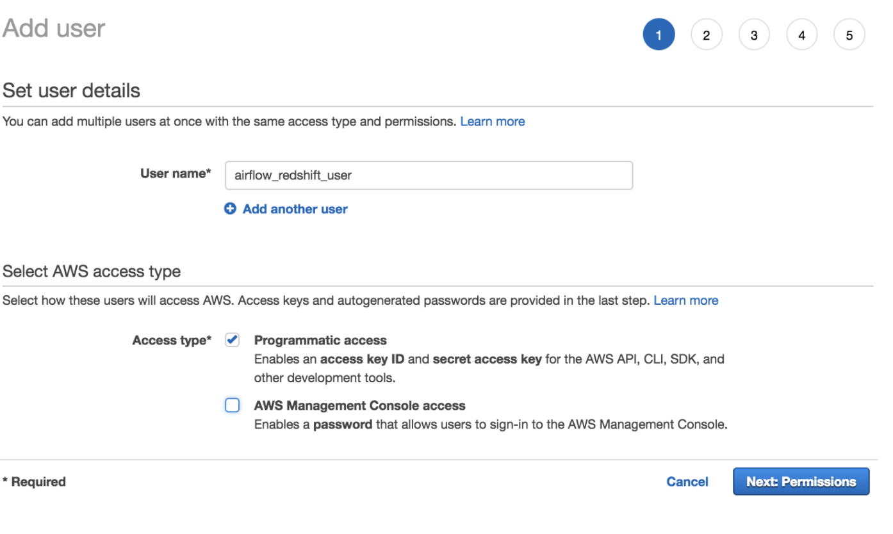
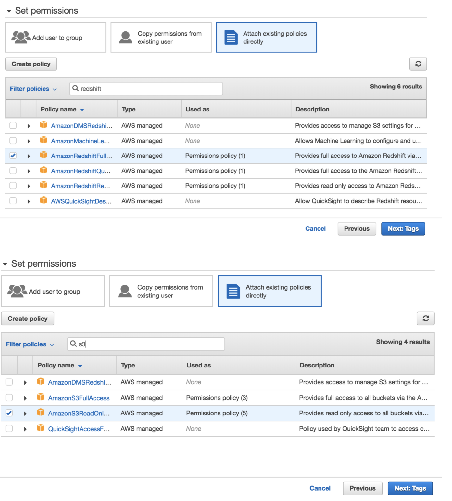
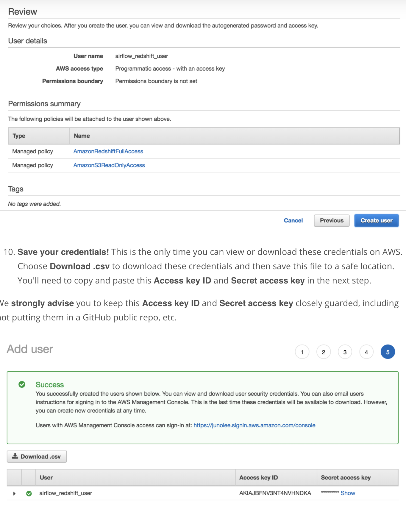

###Create an IAM User
Here, you'll create an IAM user that you will use to access your Redshift cluster.

1. Sign in to the AWS Management Console and open the IAM console at https://console.aws.amazon.com/iam/.
2. In the left navigation pane, choose ```Users```.
3. Choose ```Add User```.
4. Enter a name for your user (e.g. ```airflow_redshift_user```)
5. Choose ```Programmatic access```, then choose ```Next: Permissions```.
    
6. Choose ```Attach existing policies directly```.
7. Search for redshift and select ```AmazonRedshiftFullAccess```. Then, search for S3 and select ```AmazonS3ReadOnlyAccess```. After selecting both policies, choose ```Next: Tags```.
8. Skip this page and choose Next: ```Review```
    
9. Review your choices and choose ```Create user```.
    
    
As of June 2020, the AWS Management Console's UI has slightly changed. You can find the updated documentation on IAM roles [here](https://docs.aws.amazon.com/IAM/latest/UserGuide/id_roles.html).


