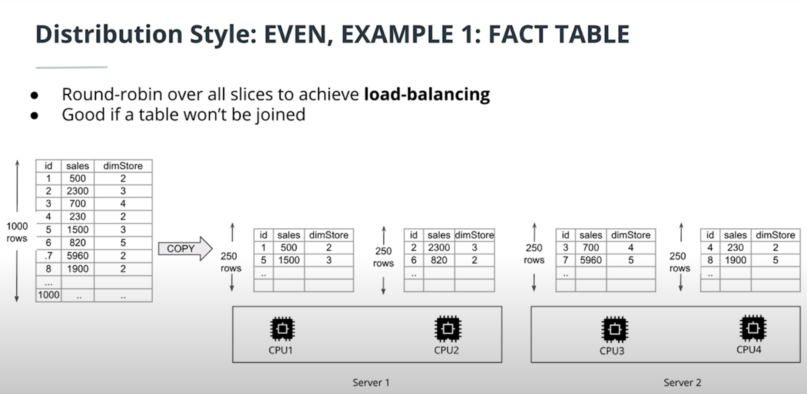
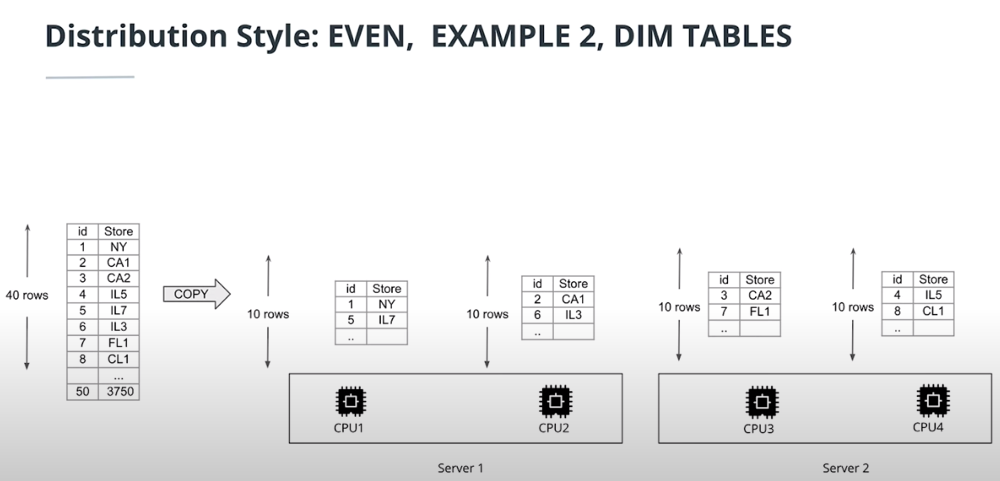
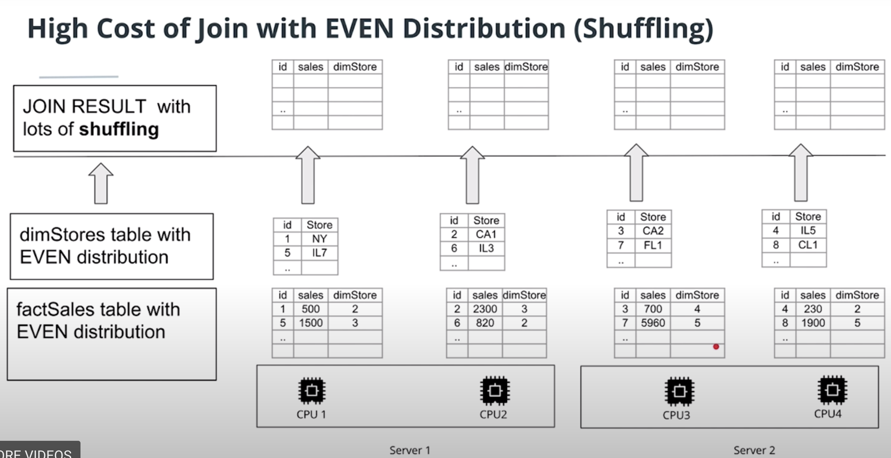
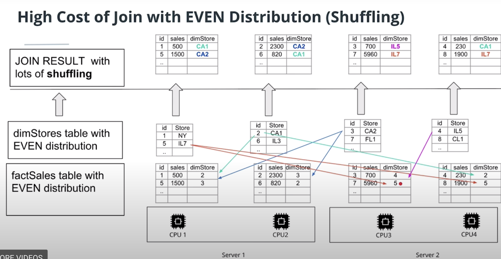
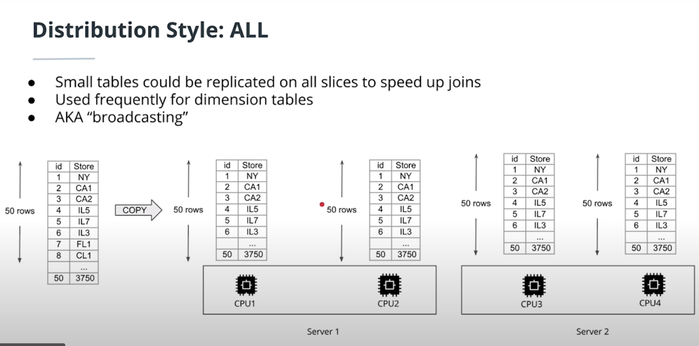
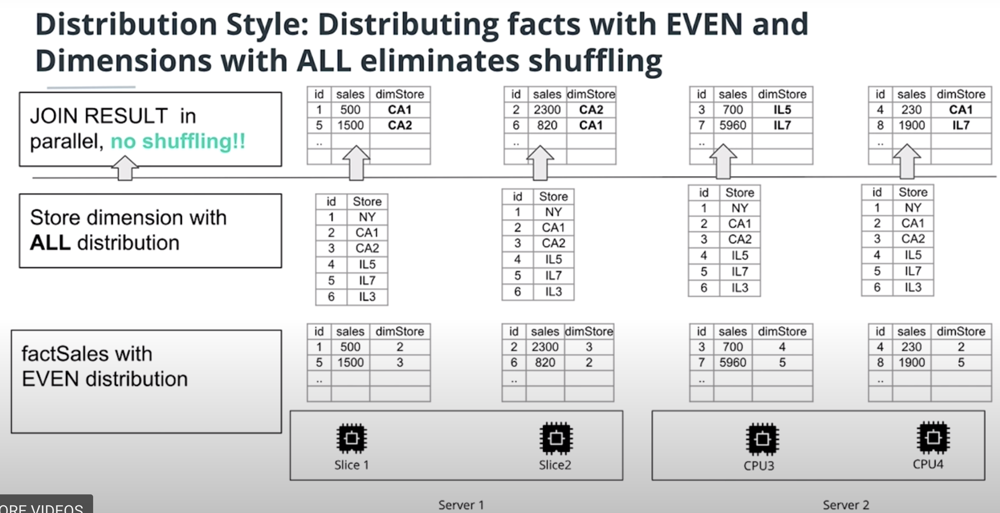
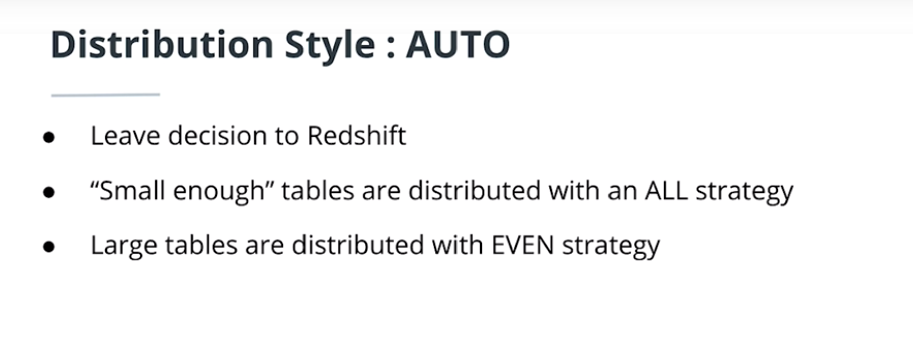
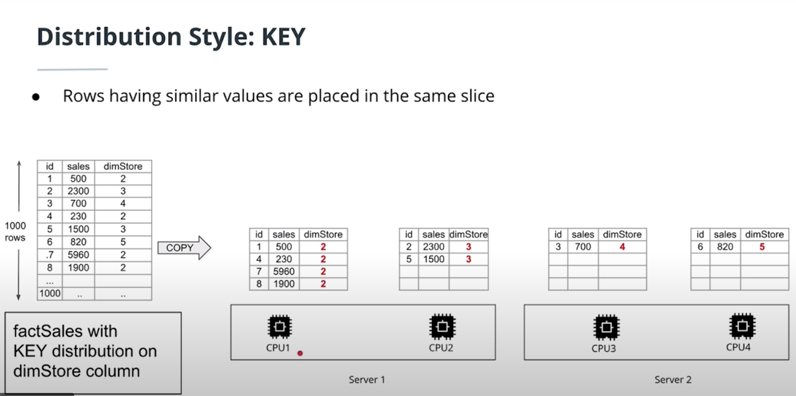
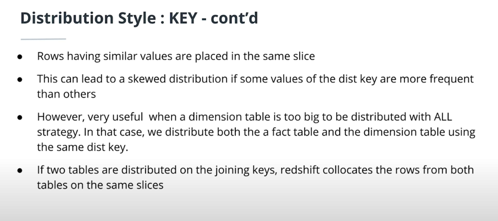
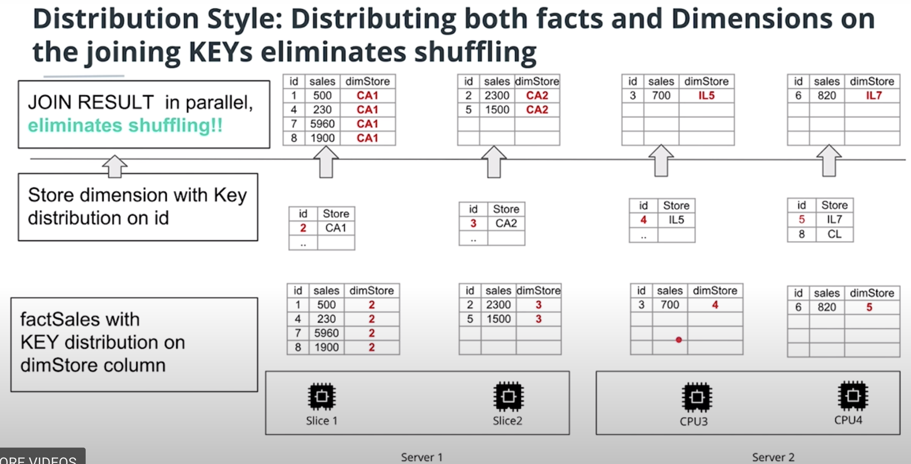

### Distribution Styles To Partition a Redshift Tables

* EVEN distribution
* ALL distribution
* AUTO distribution
* KEY distribution

### ```EVEN``` Distribution Example Fact and Dim:
  * 
  * 

#### Cost of Join with Even Distribution 
  * 
  ```NOTE```: Below image shows the possibility of network traffic over the even distribution when joining a fact and dimension tables.
  * 
  
  
### ```ALL``` Distribution Example Fact and Dim:
  * 
  * 

### ```AUTO``` Distribution Example Fact and Dim:
  * 
  
### ```KEY``` Distribution Example Fact and Dim:
  * 
  * 
  ```NOTE```: Distributing both facts and dimensions on the joining KEY's eliminates shuffling
  * 

  


  
