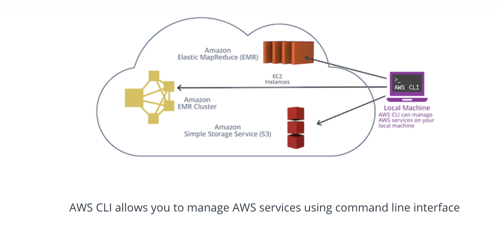

### AWS Cli



####Why use AWS CLI?
AWS CLI enables you to run commands that allow access to currently available AWS Services. We can also use AWS CLI to primarily create and check the status of our EMR instances. Mostly during your work, you would normally create clusters that are similar in sizes and functionalities, and it can get tedious when you use the AWS console to create a cluster. If you have a pre-generated script to generate EMR saved to your text editor, you can re-run as often as you’d like to generate new clusters. This way we can bypass setting security groups and roles through AWS console. You can embed all these features, including selecting number of cores, applications to install, and even custom script to execute at the time of cluster launch by using a pre-generated script.

####How to use AWS CLI?
* We’ll be using AWS CLI to create an EMR cluster.
* Check to see if you have Python 3.6 or above
* You can check the Python version using the command line: ```$ python --version```
* Install AWS CLI using ```pip install awscli```.
* Check if ```AWS CLI``` is installed correctly by typing ```aws``` into your terminal.
* If you see the image below, you have installed ```AWS CLI``` correctly.


