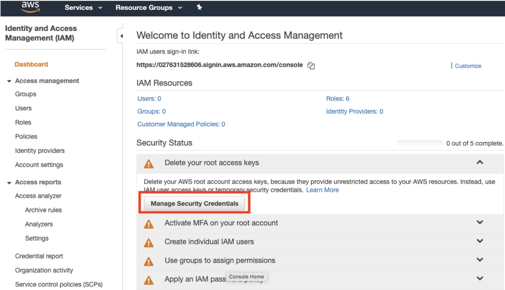
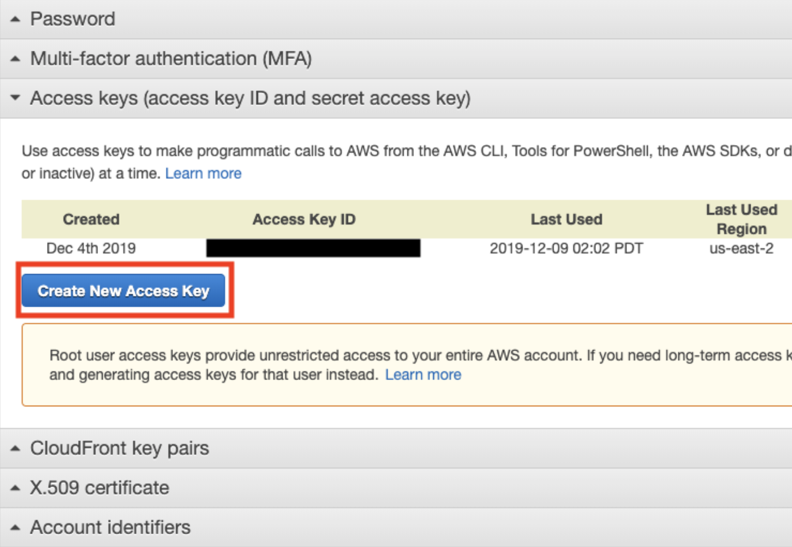
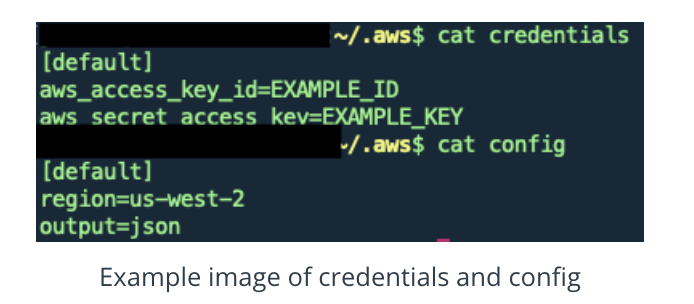

###Setting up credentials using AWS IAM
Let’s set up ```AWS IAM```. This is a service in AWS to create and manage your credentials for AWS services by creating a permission file and secret access key pairs.

The permission file and the secret access key pairs will be stored to your computer for accessing AWS services.

####How to navigate to the AWS IAM page
* From the AWS console, type IAM in the search bar.
* his will direct to the Identity and Access Management page.
* Click on the Dashboard from left.
* Click on Management Security Credentials.



This should take you to the following page.



####Storing Key Pairs
Once you’ve created the Key Pairs, make sure you ```store the [Secret Key] into some secure place``` because you will not be able to view this again. Let’s save this into your computer as well so that AWS CLI can access these keys.

* Navigate to your home folder (simply type ```cd``` in your terminal)
* Create a directory ```mkdir .aws```
* Make sure to have that period to denote a hidden directory.
* Create a file called ```credentials``` in the directory.
* Store the key pairs here as well as the default configuration for your AWS clusters.



