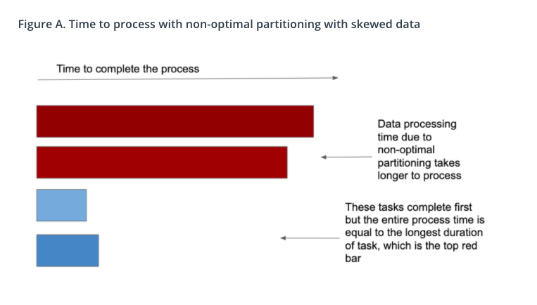
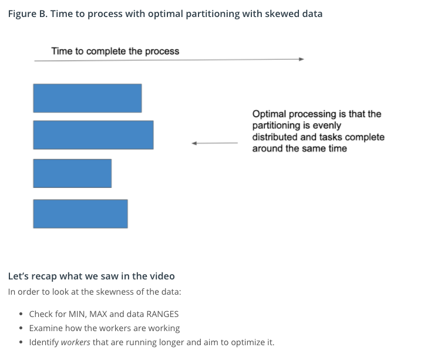

##Introduction to Dataset
In the real world, you’ll see a lot of cases where the data is skewed. Skewed data means due to non-optimal partitioning, the data is heavy on few partitions. This could be problematic. Imagine you’re processing this dataset, and the data is distributed through your cluster by partition. In this case, only a few partitions will continue to work, while the rest of the partitions do not work. If you were to run your cluster like this, you will get billed by the time of the data processing, which means you will get billed for the duration of the longest partitions working. This isn’t optimized, so we would like to re-distribute the data in a way so that all the partitions are working.

